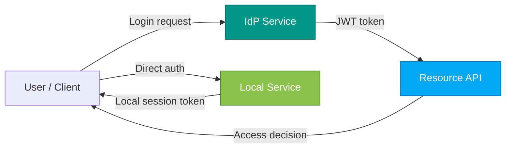

# Zero Trust Authentication – Extended Implementation

This repository extends the **BFH Zero Trust Starter** with contextual verification and dynamic risk evaluation.  
It demonstrates the shift from perimeter-based security to continuous verification across distributed microservices.

The system consists of three independent FastAPI services that illustrate both centralised and decentralised authentication:

| Service | Description |
|----------|-------------|
| **Identity Provider (IdP)** | Provides centralised authentication and issues JWTs with contextual claims. |
| **Resource API** | Represents a protected service that verifies JWTs and performs continuous contextual evaluation. |
| **Local Service** | Demonstrates decentralised authentication and independent risk-based access control. |

---

## Architecture Overview


All services are containerised an run independently, enfording micro-segmentation and clear trsut boundaries, which are key elements of Zero Trust Architecture.

## Summary of Added Logic

### Identity Provider (IdP)

The IdP was extended to issue risk-aware JWTs that include dynamic contextual data.
A new risk model was added combining multiple dimensions:

- Base risk depending on user type and department
- Device risk derived from known vs. unknown device IDs
- Time risk to punish logins outside business hours

#### Example user configuration:
```python
# Enhanced user database with risk profiles
USERS = {
    "analyst": {"password": "analyst", "role": "analyst", "risk_score": 0.2, "department": "analytics"},
    "contractor": {"password": "contractor", "role": "contractor", "risk_score": 0.6, "department": "external"},
    "admin": {"password": "admin", "role": "admin", "risk_score": 0.1, "department": "it"},
    "manager": {"password": "manager", "role": "manager", "risk_score": 0.3, "department": "management"},
}
```
#### Dynamic risk calculation:
```python
# Multi-factor risk calculation
final_risk_score = min(1.0, base_risk + device_risk + time_risk)
```

#### Example JWT claim:
```json
{
  "sub": "analyst",
  "role": "analyst", 
  "department": "analytics",
  "risk_score": 0.3,
  "device_id": "mac-001",
  "device_type": "laptop",
  "device_trust_level": 0.9,
  "login_time": "2025-10-25T14:34:39.073455+00:00"
}
```

These additinal claims enable context-aware verification in the Resource API.

### Resource API

The Resource API now contains a contextual verification module that evaluates each incoming request against several factors:

- Time-based access control: requests allowed only between 07:00–19:00
- Device trust: low-trust or unknown devices trigger additional verification
- Sensitivity-based rules: /admin and /sensitive endpoints restricted to privileged roles
- Dynamic risk evaluation: users with high risk_score require MFA or get challenged

### Local Service

The Local Service implements decentralised authentication that works without the central IdP.
It stores its own user repository and runs simplified risk checks locally, illustrating resilience and independence from the central infrastructure.

```python
# Local user database (independent from IdP)
LOCAL_USERS = {
    "local": {"password": "local", "role": "local_user", "department": "local_dept", "risk_score": 0.1},
    "admin": {"password": "admin", "role": "local_admin", "department": "local_dept", "risk_score": 0.0},
    "guest": {"password": "guest", "role": "guest", "department": "external", "risk_score": 0.8},
}
```

## Run Instructions

### 1. Clone the repository

```bash
git clone https://github.com/bfh-architecture/zt-starter.git
cd zt-starter
```

### 2. Start the environment

```bash
docker compose up --build
```

### 3. Test the authentication flow

```bash
make test-curl
```

## Testing

For testing purposes we added a **test_scenarios.sh** script that can be run. Also please see the following examples:

#### Low-Risk User (Analyst)
```bash
curl -X POST http://localhost:8001/login \
  -H 'Content-Type: application/json' \
  -d '{"username":"analyst","password":"analyst","device_id":"mac-001"}'
```

#### High-Risk User (Contractor)
```bash
curl -X POST http://localhost:8001/login \
  -H 'Content-Type: application/json' \
  -d '{"username":"contractor","password":"contractor","device_id":"unknown-device"}'
```

#### Admin Access
```bash
curl -X POST http://localhost:8001/login \
  -H 'Content-Type: application/json' \
  -d '{"username":"admin","password":"admin","device_id":"mac-001"}'
```

### Testing Contextual Verification

#### Check User Status
```bash
TOKEN=$(curl -sS -X POST http://localhost:8001/login \
  -H 'Content-Type: application/json' \
  -d '{"username":"analyst","password":"analyst","device_id":"mac-001"}' \
  | jq -er '.access_token')

curl -sS http://localhost:8002/status \
  -H "Authorization: Bearer $TOKEN" | jq .
```

#### Test Sensitive Endpoints
```bash
# Admin endpoint (requires admin role)
curl -sS http://localhost:8002/admin \
  -H "Authorization: Bearer $TOKEN" | jq .

# Sensitive data endpoint
curl -sS http://localhost:8002/sensitive \
  -H "Authorization: Bearer $TOKEN" | jq .
```

### Testing Local Authentication

#### Local Login
```bash
curl -X POST http://localhost:8003/local-login \
  -H 'Content-Type: application/json' \
  -d '{"username":"local","password":"local","device_id":"local-laptop"}' \
  -c cookies.txt
```

#### Access Local Resources
```bash
curl -sS http://localhost:8003/local-resource \
  -b cookies.txt | jq .
```

#### Check Local Status
```bash
curl -sS http://localhost:8003/local-status \
  -b cookies.txt | jq .
```

##  Repository Structure

```
zt-starter/
│-- docker-compose.yml
│-- Makefile
│-- idp/
│   ├── app.py
│   ├── .env
│   ├── Dockerfile
│-- resource_api/
│   ├── app.py
│   ├── auth.py
│   ├── context.py
│   ├── .env
│   ├── Dockerfile
│-- local_service/
│   ├── app.py
│   ├── .env
│   ├── Dockerfile
```

All `.env` files are included intentionally for educational transparency.

## License

This repository is distributed under the **MIT License**.  
It is intended for educational use within the  
Bern University of Applied Sciences (BFH) – Software Design & Architecture module.

## Maintainer

**Sebastian Höhn**  
Lecturer, Bern University of Applied Sciences (BFH)  
[BFH Wirtschaft – Institut Public Sector Transformation](https://www.bfh.ch/wirtschaft)

## Quick Summary

| Component | Description |
|------------|-------------|
| `idp/` | Issues and signs JWT tokens with contextual claims and dynamic risk scoring (centralised identity provider) |
| `resource_api/` | Verifies tokens, checks contextual factors (time, device trust, role) and enforces access policies |
| `local_service/` | Independent local authentication demo with cookie-based sessions and local risk evaluation |
| `Makefile` | Contains sample test commands for automated verification |
| `.env` files | Predefined configuration for reproducibility |


